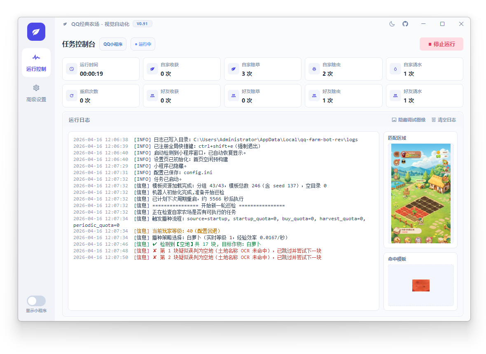

# QQ 经典农场机器人（视觉自动化版）

基于 OpenCV 的模板匹配自动化项目，统一采用**多模板 + 多尺度匹配**，全面适配任何窗口大小(横版暂不支持)，一个字”稳“！

沉浸式偷菜，让你成为农场大佬！

如果觉得这个项目 对你有帮助，欢迎⭐ Star 项目。

> 说明：项目为个人学习使用，不提供任何商业用途。目前暂不开放源代码，防止黄牛利用。

> 下载链接：[https://github.com/hacker-frok/qq-farm-bot-ai/releases/latest](https://github.com/hacker-frok/qq-farm-bot-ai/releases/latest)
## 使用提示

- 本软件完全免费，若付费购买请立即退款。
- 请认准项目主页获取版本与说明，谨防二次售卖、捆绑分发与虚假收费。
- 项目地址：[qq-farm-bot-ai](https://github.com/hacker-frok/qq-farm-bot-ai)
- 交流群：[Telegram](https://t.me/qq_farm_bot_ai)（欢迎加入讨论与反馈）

## 功能

- [x] 支持QQ/微信平台
- [x] 支持隐藏小程序窗口，沉浸式偷菜
- [x] 一键收获 / 除草 / 除虫 / 浇水
- [x] 自动购买种子
- [x] 自动播种
- [x] 收获后自动触发播种
- [x] 好友农场偷菜
- [x] 好友农场帮忙
- [x] 好友农场黑名单功能
- [x] 每日任务福利领取
- [x] 每日分享福利领取(随机分离给最近好友)
- [x] 每日商城福利领取
- [x] QQ SVIP礼包领取
- [x] 任务调度时间自定义
- [x] 好友流程冷却机制（无任务后冷却，避免频繁空转）
- [x] “下次再来”、”重新连接“检测，暂停一段时间后自动重启小程序(自动重启上线功能)
- [x] 周期性重启窗口（随机时间窗）提高长时稳定性
- [x] 休息时段自动暂停（支持跨天时段）
- [x] 每日动作次数限制（好友帮忙/自家维护）
- [x] 每日计数持久化（重启不丢失，跨天自动重置）
- [x] 命中模板与匹配区域调试预览
- [x] 全局退出热键（`Ctrl+Shift+E`）
- [ ] 多开功能（支持多开窗口，多开账号）
- [ ] 自动施肥
- [ ] ...

## 界面概览

 <picture>
    <source media="(prefers-color-scheme: dark)" srcset="./images/运行设置-dark.png" width="800px" />
    <source media="(prefers-color-scheme: light)" srcset="./images/运行设置.png" width="800px" />
    
  </picture>

   <picture>
    <source media="(prefers-color-scheme: dark)" srcset="./images/高级设置-种植-dark.png" width="800px" />
    <source media="(prefers-color-scheme: light)" srcset="./images/高级设置-种植.png" width="800px" />
    
  </picture>

 

## 运行要求

- Windows 10/11

## 下载安装运行

> 下载链接：[https://github.com/hacker-frok/qq-farm-bot-ai/releases/latest](https://github.com/hacker-frok/qq-farm-bot-ai/releases/latest)

1. 打开上方链接，下载最新的：`qq-farm-bot-ai_<tag>_x64_setup.exe`
2. 运行 `qq-farm-bot-ai_<tag>_x64_setup.exe` 进行安装。
3. 安装后会在桌面创建一个快捷方式图标（可能被安全软件拦截，请放行）
4. 打开桌面快捷方式图标，点击“开始运行”。

## 反馈问题
- 请在 [Telegram](https://t.me/qq_farm_bot_ai) 群组反馈问题。
- 请在 [GitHub](https://github.com/hacker-frok/qq-farm-bot-ai/issues) 提交 Issue。
## 已知问题
- 微信小程序会抢焦点，影响打字，目前无解，建议新建另一个桌面运行机器人，或者虚拟机中运行。
- 部分机器性能较差(虚拟机\云电脑)，需要把运行任务的时间间隔调大一些，避免卡顿或者弹窗未检测到。
- 如果启动失败，可以尝试安装[vc++类库](https://aka.ms/vc14/vc_redist.x64.exe )

## 免责声明
- 本项目仅用于学习与研究计算机视觉自动化技术。使用本项目可能违反游戏服务条款并带来账号风险，使用者需自行承担全部后果。
